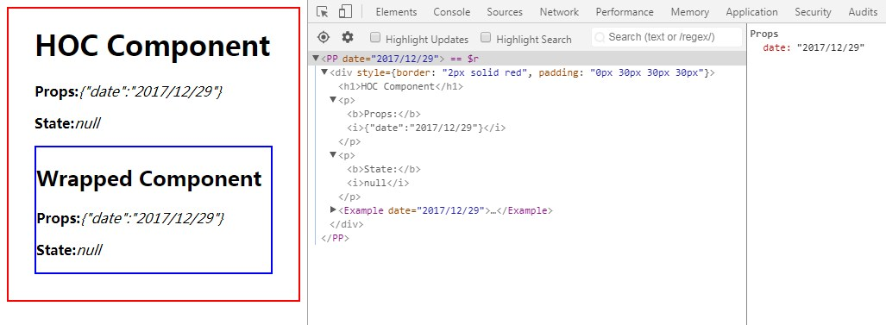
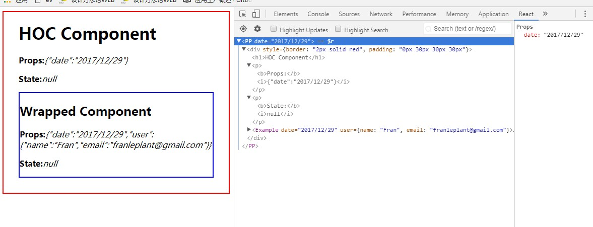
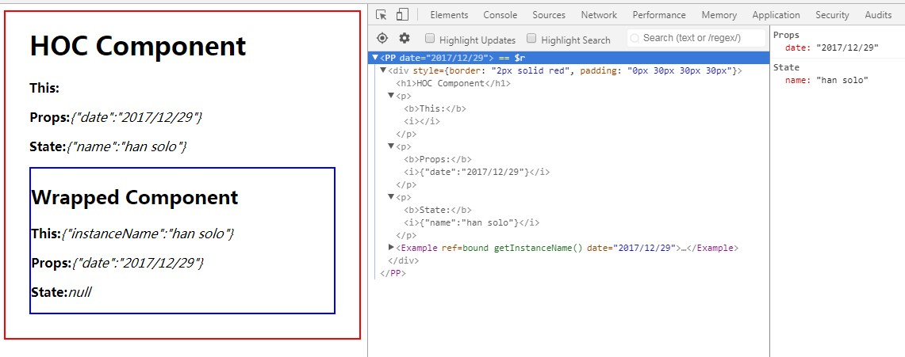
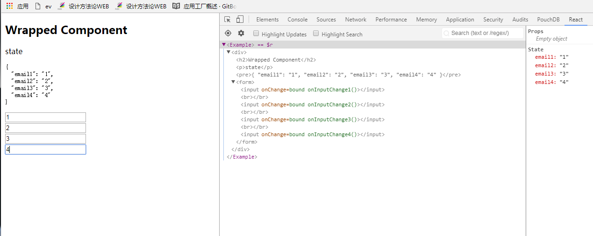
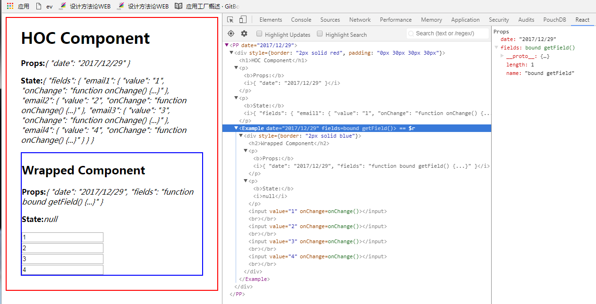
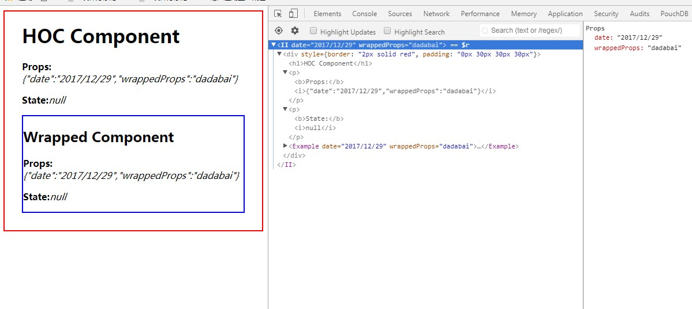
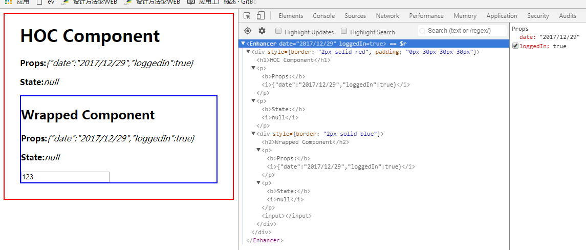
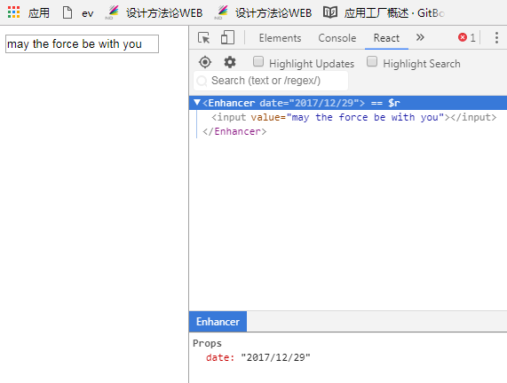
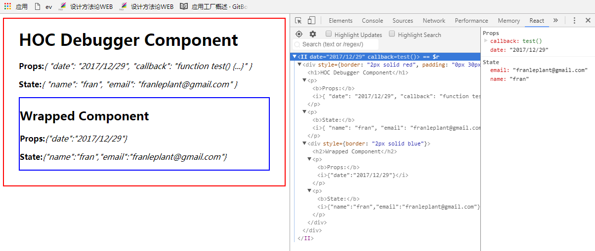

# HOC
* A collection of high order component samples.
* Run `npm install` to install dependency package.
* Run `npm start` to start serving the examples and follow the instructions on the terminal.
* Runtime environment
    - npm 4.1.1
    - node v6.10.3

---
- 高阶组件
---

# 背景介绍

## React Mixins

通过混入的方式，向现有组件类添加逻辑。mixin，是将一个模块混入到一个另一个模块中，或是一个类中。它并不是react特有的，许多编程语言都有引入了mixins这样一种特性。事实上，包括C++等一些年龄较大的OOP语言，有一个强大但危险的多重继承特性。现代语言为了权衡利弊，大都舍弃了多重继承，只采用单继承。但单继承在实现抽象时有着诸多不便之处，为了弥补缺失，如Java就引入interface，其它一些语言引入了像Mixin的技巧，方法不同,但都是为创造一种 类似多重继承的效果，事实上说它是组合更为贴切。

## Higher-Order Components

通过函数的方式，向现有组件类添加逻辑。要理解高阶组件就要先知道Higher-Order function。高阶函数在函数式编程是一个基本概念，它描述的是这样一种函数，接受函数作为输入，或是输出一个函数。比如常用的工具方法 map、reduce、sort 都是高阶函数。

## 两者的对比

1. 相同点：都是为了向组件类增加功能。
2. 不同点：mixins直截了当，HOC温婉优雅。如果说mixins是面向对象的组合，HOC则是面向函数式编程的组合。

<!-- more -->

# React Mixins

## Mixins的两种用法

1. 用法一
```javascript
import React from 'react'
import ReactDOM from 'react-dom'

let MixinA = {
    getDefaultProps: function () {
        return {
            aa: 'MixinA.props.aa',
            bb: 'MixinA.props.bb'
        }
    },
    getInitialState: function () {
        return {
            aa: 'MixinA.state.aa',
            bb: 'MixinA.state.bb'
        }
    },
    componentWillMount: function () {
        console.log('MixinA---Component will mount');
    },
    componentDidMount: function () {
        console.log('MixinA---Component did mount');
    },
    aa: function () {
        this.bb()
    }
}
let MixinB = {
    componentWillMount: function () {
        console.log('MixinB---Component will mount');
    },
    componentDidMount: function () {
        console.log('MixinB---Component did mount');
    }
}
let CompA = React.createClass({
    mixins: [MixinA, MixinB],
    getDefaultProps: function () {
        return {
            cc: 'compa.props.cc',
            dd: 'compa.props.dd'
        }
    },
    getInitialState: function () {
        return {
            cc: 'compa.state.cc',
            dd: 'compa.state.dd'
        }
    },
    componentWillMount: function () {
        console.log('CompA---Component will mount');
    },
    componentDidMount: function () {
        console.log('CompA---Component did mount');
    },
    bb: function () {
        console.log('xxxxx')
    },
    render: function () {
        console.log('CompA---Component props', this.props)
        console.log('CompA---Component state', this.state)
        this.aa()
        return (
            <div>
                react mixins使用演示
            </div>
        )
    }
})

ReactDOM.render(<CompA />, document.getElementById('root'))

```

2. 用法二

```javascript
import React from 'react'
import ReactDOM from 'react-dom'
import ReactMixin from 'react-mixin'

let MixinA = {
    getDefaultProps: function () {
        return {
            aa: 'MixinA.props.aa',
            bb: 'MixinA.props.bb'
        }
    },
    getInitialState: function () {
        return {
            aa: 'MixinA.state.aa',
            bb: 'MixinA.state.bb'
        }
    },
    componentWillMount: function () {
        console.log('MixinA---Component will mount');
    },
    componentDidMount: function () {
        console.log('MixinA---Component did mount');
    },
    aa: function () {
        this.bb()
    }
}
let MixinB = {
    componentWillMount: function () {
        console.log('MixinB---Component will mount');
    },
    componentDidMount: function () {
        console.log('MixinB---Component did mount');
    }
}

class CompA extends React.Component {
    constructor(props) {
        super(props)
        this.state = {
            cc: 'compa.state.cc',
            dd: 'compa.state.dd'
        }
    }
    componentWillMount() {
        console.log('CompA---Component will mount');
    }
    componentDidMount() {
        console.log('CompA---Component did mount');
    }
    bb() {
        console.log('At CompA dispatch function aa of MixinA and at MixinA dispatch function bb of CompA.')
    }
    render() {
        console.log('CompA---Component props', this.props)
        console.log('CompA---Component state', this.state)
        this.aa()
        return (
            <div>
                react mixins使用演示
            </div>
        )
    }
}
CompA.defaultProps = {
    cc: 'compa.props.cc',
    dd: 'compa.props.dd'
}
ReactMixin.onClass(CompA, MixinA)
ReactMixin.onClass(CompA, MixinB)

ReactDOM.render(<CompA />, document.getElementById('root'))
```

## 优缺点

1. 优点

我们能够通过在一个Mixin中维护这个共享的功能,来很容易的避免任何重复,而因此专注于只实现我们系统中真正彼此不同的功能。

2. 缺点

在 React 中，Mixins 是传统的为 Component 进行扩展的做法。Mixins 的做法很像传统的命令式编程，即要扩展的组件决定需要哪些扩展(Mixins)，以及了解所有扩展(Mixins)的细节，从而避免状态污染。当 Mixins 多了之后，被扩展组件需要维护的状态和掌握的”知识”越来越多，因此也就越来越难维护，因为责任都被交给了”最后一棒”(Last Responsible Moment)。

## Mixins小结

目前几乎很少有人会使用React.createClass的方式使用React，JSX + ES6成了标配，React团队已经声明React.createClass最终会被React.Component的类形式所取代。用ES6来编写React组件的话，将不建议你使用React的mixin机制。
高阶组件（Higher order components）作为 mixin 之外的一种组件抽象与处理形式成为mixins在ES6下的替代方案。

# Higher-Order Components

## 定义

高阶组件就是一个函数，且该函数接受一个组件作为参数，并返回一个新的组件。

> const EnhancedComponent = higherOrderComponent(WrappedComponent);

## HOC在React中的用法

### 属性代理（Props Proxy）：高阶组件操控传递给 WrappedComponent 的 props

1. 包装元素（wrapped elements）



```javascript
import React from 'react'
import ReactDOM from 'react-dom'
function PPHOC(WrappedComponent) {
    return class PP extends React.Component {
        render() {
            return (
                <div style={{border: '2px solid red', padding: '0px 30px 30px 30px'}}>
                    <h1>HOC Component</h1>
                    <p><b>Props:</b><i>{JSON.stringify(this.props)}</i></p>
                    <p><b>State:</b><i>{JSON.stringify(this.state)}</i></p>
                    <WrappedComponent {...this.props}/>
                </div>
            )
        }
    }
}
class Example extends React.Component {
    render() {
        return (<div style={{border: '2px solid blue'}}>
            <h2>Wrapped Component</h2>
            <p><b>Props:</b><i>{JSON.stringify(this.props)}</i></p>
            <p><b>State:</b><i>{JSON.stringify(this.state)}</i></p>
        </div>)
    }
}
const EnhancedExample = PPHOC(Example)
ReactDOM.render(<EnhancedExample date={(new Date).toLocaleDateString()}/>, document.getElementById('root'))
```

2. 代理props



```javascript
import React from 'react'
import ReactDOM from 'react-dom'
// Props Proxy demonstration
function PPHOC(WrappedComponent) {
    return class PP extends React.Component {
        render() {
            const props = Object.assign({}, this.props, {
                user: {
                    name: 'Fran',
                    email: 'franleplant@gmail.com'
                }
            })
            return (<div style={{border: '2px solid red', padding: '0px 30px 30px 30px'}}>
                <h1>HOC Component</h1>
                <p><b>Props:</b><i>{JSON.stringify(this.props)}</i></p>
                <p><b>State:</b><i>{JSON.stringify(this.state)}</i></p>
                <WrappedComponent {...props} />
            </div>)
        }
    }
}
class Example extends React.Component {
    render() {
        return (
            <div style={{border: '2px solid blue'}}>
                <h2>Wrapped Component</h2>
                <p><b>Props:</b><i>{JSON.stringify(this.props)}</i></p>
                <p><b>State:</b><i>{JSON.stringify(this.state)}</i></p>
            </div>
        )
    }
}
// const EnhancedExample = Example
const EnhancedExample = PPHOC(Example)
ReactDOM.render(<EnhancedExample date={(new Date).toLocaleDateString()}/>, document.getElementById('root'))
```

3. 通过 ref 获取组件实例



```javascript
import React from 'react'
import ReactDOM from 'react-dom'
// Props Proxy with ref demonstration
function PPHOC(WrappedComponent) {
    return class PP extends React.Component {
        constructor(props) {
            super(props)
            this.state = {name: ''}
            this.getInstanceName = this.getInstanceName.bind(this)
        }
        getInstanceName(instance) {
            if (instance.instanceName !== this.state.name)
                this.setState({name: instance.instanceName})
        }
        render() {
            const props = Object.assign({}, this.props, {
                ref: this.getInstanceName
            })
            return (
                <div style={{border: '2px solid red', padding: '0px 30px 30px 30px'}}>
                    <h1>HOC Component</h1>
                    <p><b>This:</b><i></i></p>
                    <p><b>Props:</b><i>{JSON.stringify(this.props)}</i></p>
                    <p><b>State:</b><i>{JSON.stringify(this.state)}</i></p>
                    <WrappedComponent {...props}/>
                </div>
            )
        }
    }
}
class Example extends React.Component {
    constructor(props) {
        super(props)
        this.instanceName = 'han solo'
    }
    render() {
        return (
            <div style={{border: '2px solid blue'}}>
                <h2>Wrapped Component</h2>
                <p><b>This:</b><i>{JSON.stringify({'instanceName': this.instanceName})}</i></p>
                <p><b>Props:</b><i>{JSON.stringify(this.props)}</i></p>
                <p><b>State:</b><i>{JSON.stringify(this.state)}</i></p>
            </div>
        )
    }
}
// const EnhancedExample = Example
const EnhancedExample = PPHOC(Example)
ReactDOM.render(<EnhancedExample date={(new Date).toLocaleDateString()}/>, document.getElementById('root'))
```

4. 抽象state



```javascript
import React from 'react'
import ReactDOM from 'react-dom'
import {stringify} from '../ii/ii_debug'
class Example extends React.Component {
    constructor(props) {
        super(props)
        this.state = {
            email1: '',
            email2: '',
            email3: '',
            email4: ''
        }
        this.onChange1 = this.onInputChange1.bind(this)
        this.onChange2 = this.onInputChange2.bind(this)
        this.onChange3 = this.onInputChange3.bind(this)
        this.onChange4 = this.onInputChange4.bind(this)
    }
    onInputChange1(e) {
        this.setState({
            email1: e.target.value
        })
    }
    onInputChange2(e) {
        this.setState({
            email2: e.target.value
        })
    }
    onInputChange3(e) {
        this.setState({
            email3: e.target.value
        })
    }
    onInputChange4(e) {
        this.setState({
            email4: e.target.value
        })
    }
    render() {
        return (
            <div>
                <h2>
                    Wrapped Component
                </h2>
                <p>
                    state
                </p>
                <pre>{stringify(this.state)}</pre>
                <form>
                    <input onChange={this.onChange1}/>
                    <br />
                    <input onChange={this.onChange2}/>
                    <br />
                    <input onChange={this.onChange3}/>
                    <br />
                    <input onChange={this.onChange4}/>
                </form>
            </div>
        )
    }
}
const EnhancedExample = Example
ReactDOM.render(<EnhancedExample />, document.getElementById('root'))
```



```javascript
import React from 'react'
import ReactDOM from 'react-dom'
import {IIHOC as DebuggerHOC, stringify} from '../ii/ii_debug'
// Props Proxy and state abstraction demonstration
function PPHOC(WrappedComponent) {
    return class PP extends React.Component {
        constructor(props) {
            super(props)
            this.state = {fields: {}}
        }
        getField(fieldName) {
            if (!this.state.fields[fieldName]) {
                this.state.fields[fieldName] = {
                    value: '',
                    onChange: event => {
                        this.state.fields[fieldName].value = event.target.value
                        this.forceUpdate()
                    }
                }
            }
            return {
                value: this.state.fields[fieldName].value,
                onChange: this.state.fields[fieldName].onChange
            }
        }
        render() {
            const props = Object.assign({}, this.props, {
                fields: this.getField.bind(this),
            })
            return (
                <div style={{border: '2px solid red', padding: '0px 30px 30px 30px'}}>
                    <h1>HOC Component</h1>
                    <p><b>Props:</b><i>{stringify(this.props)}</i></p>
                    <p><b>State:</b><i>{stringify(this.state)}</i></p>
                    <WrappedComponent {...props}/>
                </div>
            )
        }
    }
}
class Example extends React.Component {
    render() {
        return (
            <div style={{border: '2px solid blue'}}>
                <h2>Wrapped Component</h2>
                <p><b>Props:</b><i>{stringify(this.props)}</i></p>
                <p><b>State:</b><i>{stringify(this.state)}</i></p>
                <input {...this.props.fields('email1')}/>
                <br />
                <input {...this.props.fields('email2')}/>
                <br />
                <input {...this.props.fields('email3')}/>
                <br />
                <input {...this.props.fields('email4')}/>
                <br />
            </div>
        )
    }
}
const EnhancedExample = PPHOC(Example)
// 使用高阶组件作为调试器，来调试被包装组件的状态。
// const EnhancedExample = DebuggerHOC(PPHOC(Example))
ReactDOM.render(<EnhancedExample date={(new Date).toLocaleDateString()}/>, document.getElementById('root'))
```

### 反向继承（Inheritance Inversion）

高阶组件 extends wrappedComponent



```javascript
import React from 'react'
import ReactDOM from 'react-dom'
// Props Proxy demonstration
function IIHOC(WrappedComponent) {
    // return class II extends React.Component {
    return class II extends WrappedComponent {
        render() {
            return (<div style={{border: '2px solid red', padding: '0px 30px 30px 30px'}}>
                <h1>HOC Component</h1>
                <p><b>Props:</b><i>{JSON.stringify(this.props)}</i></p>
                <p><b>State:</b><i>{JSON.stringify(this.state)}</i></p>
				<WrappedComponent {...this.props}/>
				{/* <WrappedComponent /> */}
            </div>)
        }
    }
}
class Example extends React.Component {
    render() {
        return (
            <div style={{border: '2px solid blue'}}>
                <h2>Wrapped Component</h2>
                <p><b>Props:</b><i>{JSON.stringify(this.props)}</i></p>
                <p><b>State:</b><i>{JSON.stringify(this.state)}</i></p>
            </div>
        )
    }
}
Example.defaultProps = {
    wrappedProps: 'dadabai'
}
// const EnhancedExample = Example
const EnhancedExample = IIHOC(Example)
ReactDOM.render(<EnhancedExample date={(new Date).toLocaleDateString()}/>, document.getElementById('root'))
```

1. 渲染劫持（Render Highjacking）

注意：不要在属性代理中渲染劫持，因为你必须在属性代理中模拟虚拟DOM的生命周期，而不是吧虚拟DOM的生命周期交给他原来的方式做。



```javascript
import React from 'react'
import ReactDOM from 'react-dom'
function iiHOC(WrappedComponent) {
    return class Enhancer extends WrappedComponent {
        render() {
            let childTreeDom
            if (this.props.loggedIn) {
                childTreeDom = super.render()
            } else {
                childTreeDom = null
            }
            return (<div style={{border: '2px solid red', padding: '0px 30px 30px 30px'}}>
                <h1>HOC Component</h1>
                <p><b>Props:</b><i>{JSON.stringify(this.props)}</i></p>
                <p><b>State:</b><i>{JSON.stringify(this.state)}</i></p>
                {childTreeDom}
            </div>)
        }
    }
}
class Example extends React.Component {
    render() {
        return (
            <div style={{border: '2px solid blue'}}>
                <h2>Wrapped Component</h2>
                <p><b>Props:</b><i>{JSON.stringify(this.props)}</i></p>
                <p><b>State:</b><i>{JSON.stringify(this.state)}</i></p>
                <input />
            </div>
        )
    }
}
const EnhancedExample = iiHOC(Example)
ReactDOM.render(<EnhancedExample date={(new Date).toLocaleDateString()} loggedIn={true}/>, document.getElementById('root'))
```



```javascript
import React from 'react'
import ReactDOM from 'react-dom'
function iiHOC(WrappedComponent) {
	// return class Enhancer extends React.Component {
    return class Enhancer extends WrappedComponent {
		// componentWillMount(){
			
		// }
        render() {
            const elementsTree = super.render()
            // const newComponent = new WrappedComponent()
            // const elementsTree = newComponent.render()
            let newProps = {};
            if (elementsTree && elementsTree.type === 'input') {
                newProps = {value: 'may the force be with you'}
            }
            const props = Object.assign({}, elementsTree.props, newProps)
            const newElementsTree = React.cloneElement(elementsTree, props, elementsTree.props.children)
            return newElementsTree
        }
    }
}
class Example extends React.Component {
    render() {
        return (<input ></input>)
    }
}
// const EnhancedExample = Example
const EnhancedExample = iiHOC(Example)
ReactDOM.render(<EnhancedExample date={(new Date).toLocaleDateString()}/>, document.getElementById('root'))
```

2. 操作State、调试器

注意：不要在属性代理中操作state，只能抽象state。要在反向继承中操作state，不要在属性代理中抽象state



```javascript
import React from 'react'
import ReactDOM from 'react-dom'
function replacer(key, value) {
    if (typeof value === 'function') {
        return `function ${value.name}() {...}`
    }
    return value
}
export function stringify(value) {
    return JSON.stringify(value, replacer, 2)
}
// II debug example
// We are using the Inheritance Inversion technique to display
// the current state and props of the WrappedComponent (the component you want to debug).
// This is based on the technique that Mickael Jackson and Ryan Florence recommend
export function IIHOC(WrappedComponent) {
    return class II extends WrappedComponent {
        render() {
            return (
                <div style={{border: '2px solid red', padding: '0px 30px 30px 30px'}}>
                    <h1>HOC Debugger Component</h1>
                    <p><b>Props:</b><i>{stringify(this.props)}</i></p>
                    <p><b>State:</b><i>{stringify(this.state)}</i></p>
                    {super.render()}
                </div>
            )
        }
    }
}
class Example extends React.Component {
    constructor(props) {
        super(props)
        this.state = {
            name: 'fran',
            email: 'franleplant@gmail.com'
        }
    }
    render() {
        return (
            <div style={{border: '2px solid blue'}}>
                <h2>Wrapped Component</h2>
                <p><b>Props:</b><i>{JSON.stringify(this.props)}</i></p>
                <p><b>State:</b><i>{JSON.stringify(this.state)}</i></p>
            </div>
        )
    }
}
const EnhancedExample = IIHOC(Example)
ReactDOM.render(<EnhancedExample date={(new Date).toLocaleDateString()} callback={function test() {
}}/>, document.getElementById('root'))
```

## 约定

- 将不相关的props属性传递给包裹组件
    * 高阶组件应该传递与它要实现的功能点无关的props属性
    * 向包裹组件注入props属性，一般都是高阶组件的state状态或实例方法
- 最大化使用组合
    ```javascript
    const EnhancedComponent = connect(commentSelector)(withRouter(WrappedComponent))
    const enhance = compose(connect(commentSelector),withRouter)
    const EnhancedComponent = enhance(WrappedComponent)
    ```
- 包装显示名字以便于调试
    * 当组件应用到高阶组件中后，显示的组件都一致，就无法发区分是那个wrapped组件被高阶组件包装了。所以要显示的指	定displayName
    * 一般是“高阶组件名称+wrapped组件名称”

## 注意事项

- 不要在render函数中使用高阶组件
    * 每一次render函数调用都会创建一个新的EnhancedComponent实例。
- 必须将静态方法做拷贝
    * 当使用高阶组件包装组件，原始组件被容器组件包裹，也就意味着新组件会丢失原始组件的所有静态方法。
    * 可以使用hoist-non-react-statics来帮你自动处理，它会自动拷贝所有非React的静态方法。
- Refs属性不能传递
    * refs是一个伪属性，React对它进行了特殊处理。
    * 如果你向一个由高级组件创建的组件的元素添加ref应用，那么ref指向的是最外层容器组件实例的，而不是包裹组件。
    * React在任何时候都不建议使用ref，如果真的要使用就必须多ref的函数有个清晰的认识，并在在高阶组件中代理实现它。


## HOC小结

|         |Props Proxy  |Inheritance Inversion|
|:-------:|:-----------:|:-------------------:|
|Props    |	建议使用	 |   可以使用           |
|State    |	建议抽象state|   建议操作state      |
|Ref	  | 建议使用	 |   可以使用           |
|LifeCycle|	不建议使用	|   建议使用           |

# 总结

- HOC与设计模式
    * 代理模式
    * 适配器模式
    * 装饰者模式
    * ...

# 关联阅读

- 深入理解 React 高阶组件
http://www.jianshu.com/p/0aae7d4d9bc1
- Facebook对高阶组件的官方文档
https://facebook.github.io/react/docs/higher-order-components.html
- Mixins Considered Harmful
https://facebook.github.io/react/blog/2016/07/13/mixins-considered-harmful.html
- Decorators in ES7
http://hackll.com/2015/07/24/decorators-in-es7/%0d

---
<div align=center><h2>如果觉得我的文章对您有用，请随意打赏。您的支持将鼓励我继续创作！</h2></div>
<div align=center></div>
